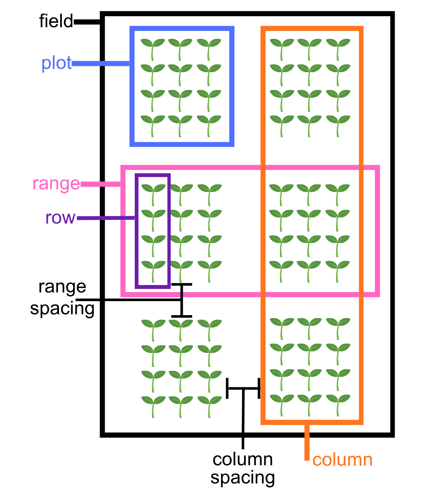
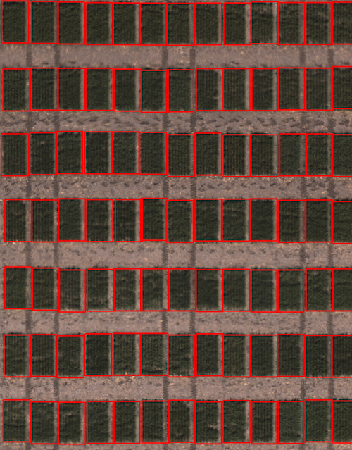

## class Field_layout

A PlantCV-Geospatial object class.

*class* plantcv.geospatial.**Field_layout**

`Field_layout` is a class used to store parameters of a field planting strategy. These parameters can then be used in automatic plot boundary shapefile creation, such as using `plantcv.geospatial.create_shapes.auto_grid` and `plantcv.geospatial.create_shapes.grid_from_coords`.    

An instance of the `Field_layout` class called "field_layout" is initiated on importing PlantCV-Geospatial. We recommend filling in known parameters of your field as a first step in creating an analysis workflow (see example below). This is similar to how `plantcv` uses `params` in many functions if you are already familiar with the main `plantcv` package.

### Attributes

Attributes are accessed as field_layout.*attribute*.

**num_ranges**: Integer number of ranges containing plots in your field. 

**num_columns**: Integer number of columns containing plots in your field

**range_length**: Size of each range of plots. Units (meters for example) should match the units of any shapefile you intend to use to designate plot boundaries.  

**row_length**: Size of each row within a plot. Units (meters for example) should match the units of any shapefile you intend to use to designate plot boundaries.

**num_rows**: Integer number of rows in each plot.

**range_spacing**: Size of the alley in between ranges of plots. Units (meters for example) should match the units of any shapefile you intend to use to designate plot boundaries.

**column_spacing**: Size of alley in between columns of plots. Units (meters for example) should match the units of any shapefile you intend to use to designate plot boundaries.

### Example diagram of a field layout with attributes labeled



- **Example use:**
    - Example image from the [Bison-Fly: UAV pipeline at NDSU Spring Wheat Breeding Program](https://github.com/filipematias23/Bison-Fly) below. 

```python
import plantcv.geospatial as gcv

# Set field parameters
field_layout.range_length = 3.65
field_layout.row_length = 0.9

# Read geotif in
ortho1 = gcv.read_geotif(filename="./data/example_maize_img.tif", bands="b,g,r,RE,NIR")
# Create plots using parameter values in field_layout
figure = gcv.create_shapes.grid_from_coords(img=ortho1, field_corners_path="bounds.geojson",
            plot_geojson_path="plot_points.geojson",
            out_path="gridcells.geojson")

```



**Source Code:** [Here](https://github.com/danforthcenter/plantcv-geospatial/blob/main/plantcv/geospatial/classes.py)
