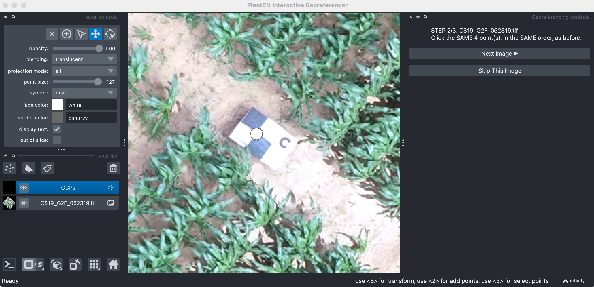

## class InteractiveGeoreferencer

A PlantCV-Geospatial data object class.

*class* **plantcv.geospatial.georeference.InteractiveGeoreferencer**(*img_dir, output_dir, mode="known_coordinates", known_coords=None, reference_image=None, transform_type="affine", interpolation_order=1, show=True*)

- **Parameters:**
    - img_dir - Path to a directory containing geotifs to be georeferenced. 
    - output_dir - Path to a directory for writing georeferenced files to. Parent directories will be created if they do not already exist.
    - mode - Specifies whether to georeference using ground control points (GCPs) with known geographical coordinates ("known_coordinates" mode) or using a reference image to match GCP location to ("reference_image" mode).
    - known_coords - List of (float, float) pairs with latitude and longitude of GCPs. Only used if mode="known_coordinates". Must be in the same coordinate reference system as the input geotifs to georeference. 
    - reference_image - Path to the location of the geotif to be used as a reference (to match all other geotifs to). Can be located within "img_dir." Only used when mode="reference_image."
    - transform_type - Type of warp used for georeferencing. See details below. Defaults to "affine."
    - interpolation_order - Pixel resampling interpolation degree used when warping (0=nearest neighbor, 1=bilinear, 3=bicubic). Default is 1. 
    - show - Whether or not to show the napari window. Useful for testing, defaults to True.  

`InteractiveGeoreferencer` is a class that is used to interactively find and select ground control points in a set of images so that georeferencing can be done automatically and in one step. When initiated (see below for examples), a napari viewer window opens with either a reference image or the first image in `img_dir`. Instructions on the side bar will tell a user how many images there are in the queue and how many GCPs need to be clicked for the selected transformation method. After clicking all GCPs for the first image, a user will click the "Next Image" button to proceed through the queue until all images have had GCPs identified. 

### Attributes

* **viewer**: An interactive viewer object.

* **gcps**: Dictionary of GCP click positions per image.

### Methods

* **georeference**: (): Perform georeferencing and save new geotifs to `output_dir`.

* **close**: (): Close the viewer object window.

### Transform type options
The method of warping to fit clicked to known coordinate positions, specified by `transform_type`, has the following options: 

| Option | What it does | Min. points | QGIS analog | Key difference from QGIS |
|---|---|---|---|---|
| `"affine"` | A single global 6-parameter transform (translation, rotation, scale, shear). Straight lines stay straight and parallel lines stay parallel everywhere in the image. | 3 | **Linear** | None — same 6-parameter model. (QGIS's separate **Helmert** option, a more restrictive 4-parameter similarity transform, isn't offered.) |
| `"polynomial2"` | A 2nd-order polynomial warp. Allows the image to bend/curve, correcting mild non-linear distortion that a single global affine can't. | 6 | **Polynomial 2** | None. |
| `"polynomial3"` | A 3rd-order polynomial warp. More locally flexible than `"polynomial2"`, at the cost of needing more, well-spread points to stay numerically stable. | 10 | **Polynomial 3** | None. Orders beyond 3 aren't offered — they need disproportionately more points for a fit that isn't obviously better, and become numerically unstable well before reaching them. |
| `"tps"` | A locally flexible warp: the image is triangulated between control points and each triangle gets its own small affine transform, so it bends independently near each point instead of applying one global rule. | 4 | **Thin Plate Spline (TPS)** | **This is not a true TPS.** `scikit-image` has no thin-plate-spline implementation, so this is approximated with a piecewise-affine (Delaunay-triangulated) warp instead. It shares TPS's local flexibility and exactness at control points, but produces subtle creases at triangle edges rather than one smooth bending surface. |
| `"projective"` | A perspective/homography warp (8 parameters). Straight lines stay straight, but parallel lines can converge — the right choice for true perspective distortion, like a photo taken at an angle to the ground. | 4 | **Projective** | None. |


### Examples

```python
import plantcv.geospatial as gcv
import plantcv.plantcv as pcv


# Read in an image
img = gcv.read.geotif("./grid_field.tif", bands="B,G,R,RE,N")

# Initialize an InteractiveGeoreferencer class object 
viewer = gcv.georeference.InteractiveGeoreferencer(img_dir="./cropped/",
                                                   output_dir="./georef/",
                                                   mode="reference_image",
                                                   transform_type="projective",
                                                   reference_image="./cropped/earliest_timepoint.tif")

# Follow the instructions on the right side of the viewer
# You will click GCPs on each image in the folder and then click "Next Image"

```

```python
# In a new cell, run the georeferencer
# Note - this step can take quite awhile, especially if you have many images
viewer.georeference()

```

**Clicking GCPs in the second of three images:**




**Source Code:** [Here](https://github.com/danforthcenter/plantcv-geospatial/blob/main/plantcv/geospatial/georeference/interactive_georeferencer.py)
