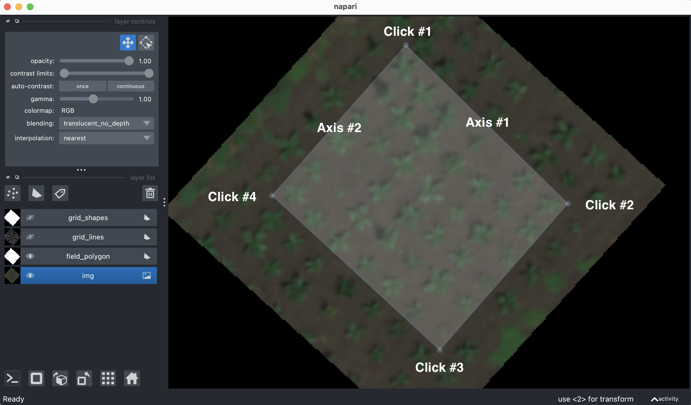
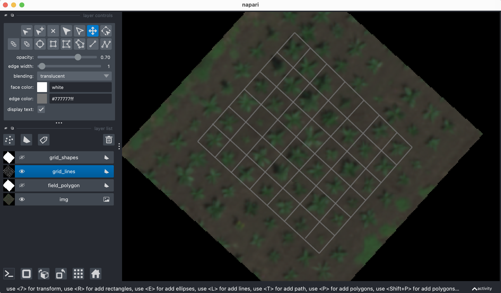
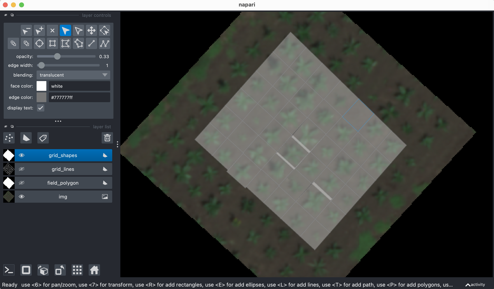

## class InteractiveShapes

A PlantCV-Geospatial data object class.

*class* **plantcv.geospatial.create_shapes.InteractiveShapes**(*img, viewer_type="napari", field_layer="field_boundary", show=True*)

- **Parameters:**
    - img - GEO image object, likely read in with [`geo.read_geotif`](read_geotif.md).
    - viewer_type (str, default = "napari"): Viewer type, currently only `"napari"` is supported
    - field_layer (str, default = "field_boundary"): Name for the first added shapes layer. The `grid` and `plot` methods will assume that this layer outlines the entire field and this name will be associated with the "field_boundary" key in the `layer_dict` attribute.
    - show (boolean, default = `True`): Should the napari viewer be shown?

`InteractiveShapes` is a class that is used to create instances of interactive image viewers. Users can use layers of the viewer to manually create plot boundaries. Interactive viewers are useful for field layouts involving individual plants in rough but imperfect grids. 
Methods using `InteractiveShapes` objects can automatically draw lines separating plots, which can be manually corrected before using the lines to draw plot boundary polygons, which can again be manually corrected before saving as a shapefile.

### Attributes

Attributes are accessed as `interactive_shapes_instance.attribute`.

* **img**: The image used in the viewer object.

* **viewer**: An interactive viewer object.

* **viewer_type**: Type of interactive viewer. Currently, only "napari" is supported. 

* **layer_dict**: Dictionary of layer names in the viewer. Keys represent commonly used shapes important for methods of this class. Notably, `"field_boundary"` denotes a polygon encompassing the entire field, `"grid_lines_columns"` denotes lines separating columns of plots, `"grid_lines_ranges"` denotes lines separating ranges of plots, and `"Plots"` denotes individual plot polygons (if `plots` method is called with default arguments).

### Methods

* **add_layer**: (*layer_type="shapes", layername="Shapes"*): Add a layer to the viewer.
    * layer_type (str, default = "shapes"): Type of layer to add, must be `"shapes"` or `"points"`
    * layername (str, default = "Shapes"): Name for the new layer.

* **grid**: (*numdivs*): Add layers with lines evenly dividing a grid within the field boundary. Adds new `"grid_lines_columns"` and `"grid_lines_ranges"` layers.
    * numdivs (array, required): length 2 array-like of int specifying numbers of columns and ranges as `[N columns, N ranges]`
	
* **plots**: (*plot_layer="Plots"*): Add a layer of polygons divided by `"grid_lines_columns"` and `"grid_lines_ranges"` layers.
    * plot_layer (str, default = "Plots"): Name for the new layer of polygons.

* **to_points**: (*dest=None, layername="Points"*): Return the points from the viewer as a list, writing to a geojson file specified by `dest`. Calls `plantcv.geospatial.convert.points`.
    * dest (str, optional): File path to write a geojson of the specified points layer to.
	* layername (str, default = "Points"): Name of the layer to return/write.

* **to_shapes**: (*dest=None, shapetype="polygon", layername="Shapes"*): Return the polygons from the viewer as a list, writing to a geojson file specified by `dest`. Calls `plantcv.geospatial.convert.shapes`.
    * dest (str, optional): File path to write a geojson of the specified points layer to.
	* shapetype (str, default = "polygon"): Type of shape to use.
	* layername (str, default = "Shapes"): Name of the layer to return/write.


### Examples

```python
import plantcv.geospatial as gcv
import plantcv.plantcv as pcv
# Adjust line thickness (default is 5)
pcv.params.line_thickness = 8

# Initialize an InteractiveShapes class object 
# and add an image layer and field boundary layer to the viewer
editor = gcv.create_shapes.InteractiveShapes(img, field_layer="field_boundary")

# After drawing a polygon around the field in the "field_boundary" layer, 
# automatically draw a grid of lines
# Uses layer_dict["field_boundary"] to find layer containing field outline
editor.grid(numdivs=[3,4])

# After correcting lines until they enclose individual plots, 
# draw polygons using the line intersections
# Uses layer_dict["grid_lines_columns"] and layer_dict["grid_lines_ranges"] 
# to find layers containing lines
editor.plots()

# PlantCV Regions of Interest (ROIs) can be drawn from centers of polygons
rois = gcv.center_grid_rois(editor, radius=9, layername="Plots")

# Individual plot boundaries can then be saved to a file
editor.to_shapes(dest="./plots.geojson", layername="Plots")

# Custom layers can be added for other more manual shape creation
editor.add_layer(layer_type="shapes")
```

**Adding field polygon to shapes layer:**



**After adjusting position of grid lines:**



**After adjusting vertices of grid polygons:**



**Source Code:** [Here](https://github.com/danforthcenter/plantcv-geospatial/blob/main/plantcv/geospatial/create_shapes/interactive_shapes.py)
