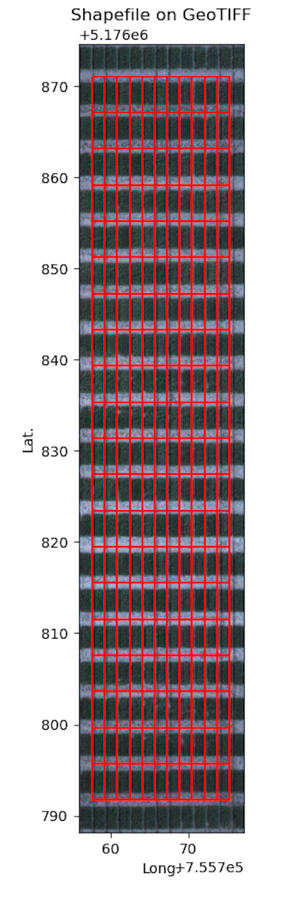

## Analyze color for regions in a geojson shapefile

Vectorized approach to color stats and histograms per region in a shapefile using a binary mask. 

**plantcv.geospatial.analyze.color**(*(img, bin_mask, geojson, bins=10, colorspaces="hsv", label=None)*)

**returns** Debug histogram of hue circular mean across plots.

- **Parameters:**
    - img - Spectral image object, likely read in with [`geo.read_geotif`](read_geotif.md)
    - bin_mask - Binary mask, numpy array
    - geojson - Path to the shapefile/GeoJSON containing the plot boundaries. Can be Polygon or MultiPolygon geometry.

- **Context:** 
    - **Output data stored:** Data ('mean', 'std', 'counts', 'bin_edges') for each specified channel and ('hue_circular_mean', 'hue_circular_std') for each plot automatically gets stored to the [`Outputs` class](https://plantcv.readthedocs.io/en/stable/outputs/#class-outputs) when this function is run. These data can be accessed during a workflow (example below). For more detail about data output see [Summary of Output Observations](https://plantcv.readthedocs.io/en/stable/output_measurements/).

- **Example use:**
    - Example images and geojson from the [Bison-Fly: UAV pipeline at NDSU Spring Wheat Breeding Program](https://github.com/filipematias23/Bison-Fly) below. 

```python
import plantcv.geospatial as gcv
import plantcv.plantcv as pcv

# Read geotif in
ortho1 = gcv.read_geotif(filename="./data/example_img.tif", bands="b,g,r,RE,NIR")
# Create or read in a binary mask 
# Analyze coverage for each region in the geojson
vis = gcv.analyze.color(img=ortho1, bin_mask=plant_mask,
                           geojson="./shapefiles/experimental_plots.geojson")

# To access individual observation values:
print(pcv.outputs.observations["default_0"]["hue_circular_mean"]["value"])

```


**Source Code:** [Here](https://github.com/danforthcenter/plantcv-geospatial/blob/main/plantcv/geospatial/analyze/color.py)
