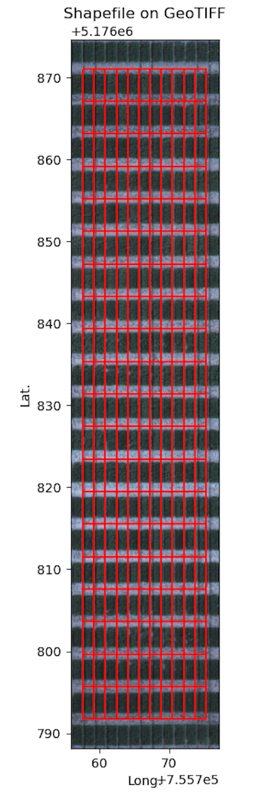

## Analyze coverage for regions in a geojson shapefile

Vectorize approach to pixel count and percent coverage per region in a shapefile. 

**plantcv.geospatial.analyze.coverage**(*img, bin_mask, geojson*)

**returns** Debug image with regions drawn on the input image.

- **Parameters:**
    - img - Spectral image object, likely read in with [`geo.read_geotif`](read_geotif.md)
    - bin_mask - Binary mask, numpy array
    - geojson - Path to the shapefile/GeoJSON containing the points. Can be Polygon or MultiPolygon geometry.

- **Context:**
    - This function will utilize the geojson's `ID` attribute for `Outputs` labels if available. 

- **Example use:**
    - below

```python
import plantcv.geospatial as geo

# Read geotif in
ortho1 = geo.read_geotif(filename="./data/example_img.tif", bands="b,g,r,RE,NIR")
# Create or read in a binary mask 
# Analyze coverage for each region in the geojson
vis = geo.analyze.coverage(img=ortho1, bin_mask=plant_mask,
                           geojson="./shapefiles/experimental_plots.geojson)

```


**Source Code:** [Here](https://github.com/danforthcenter/plantcv-geospatial/blob/main/plantcv/geospatial/analyze/coverage.py)
