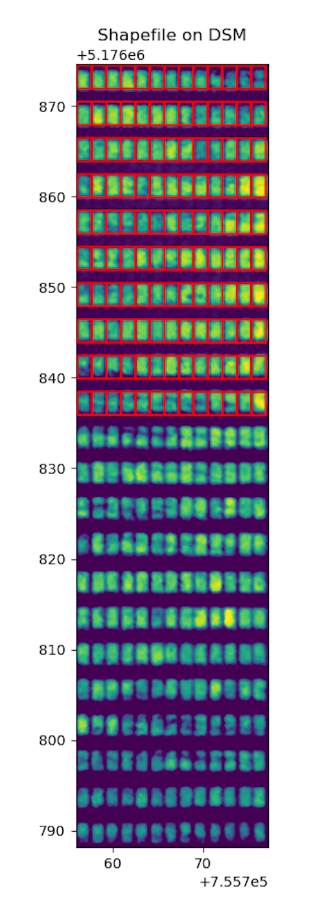

## Analyze height for regions in a geojson shapefile using regional percentiles

Vectorize approach to height estimation per region in a shapefile using a binary mask. Calculates the soil elevation as the
lower percentile and uses the upper percentile as plot elevation. 

**plantcv.geospatial.analyze.height_percentile**(*dsm, geojson, lower=25, upper=90, label=None*)

**returns** Debug image with regions drawn on the input DSM (digital surface model).

- **Parameters:**
    - img - Spectral image object, likely read in with [`geo.read_geotif`](read_geotif.md)
    - lower - Lower percetile cut off, default `lower=25`
    - upper - Upper percetile cut off, default `upper=90`
    - geojson - Path to the shapefile/GeoJSON containing the points. Can be Polygon or MultiPolygon geometry.
    - label - Optional label parameter, modifies the variable name of observations recorded. Can be a prefix, or list (default = `pcv.params.sample_label`)

- **Context:**
    - This function will utilize the geojson's `ID` attribute for `Outputs` labels if available. 
    - **Output data stored:** Data ('soil_elevation', 'plant_elevation', 'plant_height') automatically gets stored to the [`Outputs` class](https://plantcv.readthedocs.io/en/stable/outputs/#class-outputs) when this function is run. These data can be accessed during a workflow (example below). For more detail about data output see [Summary of Output Observations](https://plantcv.readthedocs.io/en/stable/output_measurements/).

- **Example use:**
    - Example images and geojson from the [Bison-Fly: UAV pipeline at NDSU Spring Wheat Breeding Program](https://github.com/filipematias23/Bison-Fly) below. 

```python
import plantcv.geospatial as gcv
import plantcv.plantcv as pcv

# Read geotif in
dsm = gcv.read_geotif(filename="./data/example_dsm.tif", bands="0")
# Create or read in a binary mask 
# Analyze coverage for each region in the geojson
bounds = gcv.analyze.height_percentile(dsm=dsm,
                           geojson="./shapefiles/experimental_plots.geojson",
                           lower=25,
                           upper=90,
                           label="default")

# To access individual observation values:
print(pcv.outputs.observations["default_0"]["plant_height"]["value"])

```


**Source Code:** [Here](https://github.com/danforthcenter/plantcv-geospatial/blob/main/plantcv/geospatial/analyze/dsm.py)
