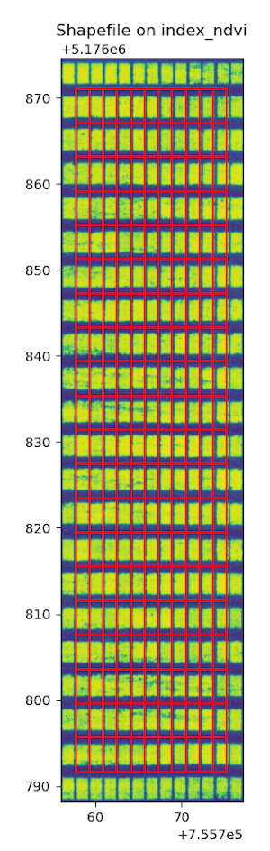

## Analyze spectral index signatures for regions in a geojson shapefile using zonalstats

Vectorize approach to spectral index analysis per region in a shapefile.

**plantcv.geospatial.analyze.spectral_index**(*img, geojson, percentiles=None, label=None*)

**returns** Debug image with regions drawn on the input index.

- **Parameters:**
    - img - Spectral image object, likely created with one of the functions from [`pcv.spectral_index`](https://plantcv.readthedocs.io/en/latest/spectral_index/)
    - geojson - Path to the shapefile/GeoJSON containing the plot boundaries. Can be Polygon or MultiPolygon geometry.
	- percentiles - Iterable of numeric percentiles [0-100]. 0 and 100 are automatically included (default = `None`, where `range(0, 101, 25)` is used)
    - label - Optional label parameter, modifies the variable name of observations recorded. Can be a prefix, or list (default = `pcv.params.sample_label`)

- **Context:**
    - This function will utilize the geojson's `ID` (or `FID`) attribute for `Outputs` labels if available and `label=None`. 
    - **Output data stored:** Data (index minimum, maximum, mean, median, standard deviation, percentile_25, and percentile_75) automatically gets stored to the [`Outputs` class](https://plantcv.readthedocs.io/en/stable/outputs/#class-outputs) when this function is run. These data can be accessed during a workflow (example below). For more detail about data output see [Summary of Output Observations](https://plantcv.readthedocs.io/en/stable/output_measurements/).

- **Example use:**
    - Example images and geojson from the [Bison-Fly: UAV pipeline at NDSU Spring Wheat Breeding Program](https://github.com/filipematias23/Bison-Fly) below. 

```python
import plantcv.geospatial as gcv
import plantcv.plantcv as pcv

# Read in multiband image as geotif
img = gcv.read_geotif(filename="./data/EX_8_DAP_46_2021_Casselton_YT_06-22_5band.tif", bands="b,g,r,RE,NIR")
# calculate NDVI for example
ndvi = pcv.spectral_index.ndvi(img)
# Analyze coverage for each region in the geojson
bounds = gcv.analyze.spectral_index(img=ndvi,
                           geojson="./Shapefiles/shapefile.shx",
                           label=None)

# To access individual observation values:
print(pcv.outputs.observations['default_1']['mean_index_ndvi']['value'])

```


**Source Code:** [Here](https://github.com/danforthcenter/plantcv-geospatial/blob/main/plantcv/geospatial/analyze/spectral.py)
