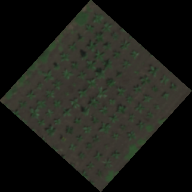
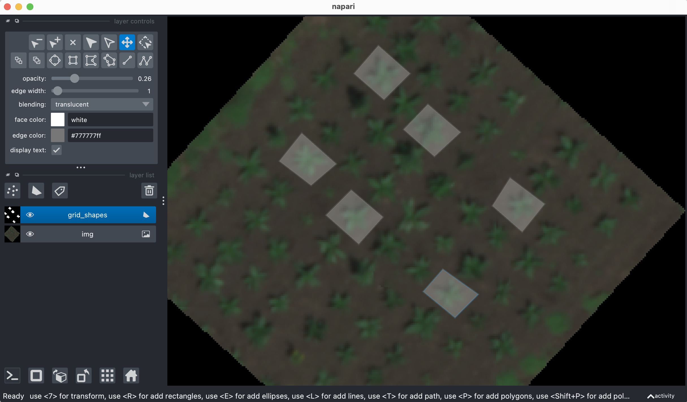
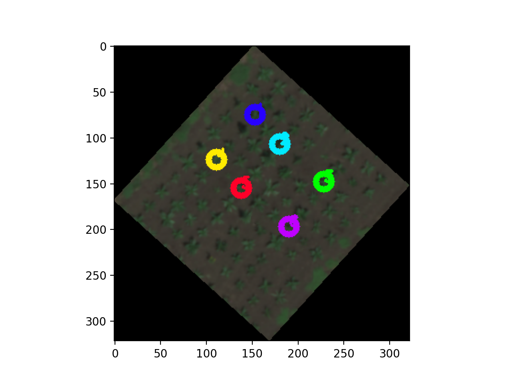

## ROIs from the center of gridded polygons

After using a Napari viewer, and possibly the combination of `create_shapes.napari_grid` and `create_shapes.napari_polygon_grid`, this function takes a viewer's shapes layer and turns the center point of every polygon into a circular Region of Interest (ROI) for downstream analysis of individual objects. 

**plantcv.geospatial.center_grid_rois**(*editor, radius=10, layername="Shapes"*)

**returns** roi_objects

- **Parameters:**
    - editor - [`InteractiveShapes`](InteractiveShapes.md) class object. 
    - radius - Pixel value of the radius of ROIs. Default is 10.
	- layername - Name of shape layer containing polygons, defaults to "Shapes".

- **Context:**
    - Though this function is designed to be used after drawing polygons in a grid using `create_shapes.napari_grid` and `create_shapes.napari_polygon_grid`, it can be used to draw ROIs using polygons formed by hand, read in from a shapefile, or drawn using custom algorithms. 

- **Example use:**
    - Below is an example of using hand-drawn polygons. For an example of making grid polygons, see [InteractiveShapes Documentation](https://github.com/danforthcenter/plantcv-geospatial/blob/main/docs/InteractiveShapes.md)

```python
import plantcv.plantcv as pcv
import plantcv.geospatial as gcv

pcv.params.debug = "plot"

# Read geotif in
img = gcv.read_geotif("./grid_field.tif", bands="B,G,R,RE,N")
# Add a shapes layer to your InteractiveShapes editor
editor = gcv.create_shapes.InteractiveShapes(img)
editor.add_layer()

# Now, when the Napari viewer opens, the user can add polygons around individual plants or plots.

# Draw ROIs
rois = gcv.center_grid_rois(editor, radius=9)

# Resulting ROIs can be used for downstream analysis of individual objects in PlantCV

```

**Read in geotif:**



**Adding polygons to shapes layer:**



**Drawn ROIs:**




**Source Code:** [Here](https://github.com/danforthcenter/plantcv-geospatial/blob/main/plantcv/geospatial/center_grid_rois.py)
