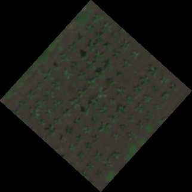

## ROIs from the center of gridded polygons

After using a Napari viewer, and possibly the combination of `napari_grid` and `napari_polygon_grid`, this function takes a viewer's shapes layer and turns the center point of every polygon into a circular Region of Interest (ROI) for downstream analysis of individual objects. 

**plantcv.geospatial.center_grid_rois**(*img, viewer, radius=10*)

**returns** roi_objects

- **Parameters:**
    - img - Image or pseudo_rgb attribute of a spectral object on which to draw the ROIs.
    - veiwer - Napari viewer object. Must have a shapes layer called "grid_shapes" containing polygons, the centers of which will become the center of ROIs.
    - radius - Pixel value of the radius of ROIs. Default is 10.  

- **Context:**
    - Though this function is designed to be used after drawing polygons in a grid using `napari_grid` and `napari_polygon_grid`, it can be used to draw ROIs using polygons formed by hand, read in from a shapefile, or drawn using custom algorithms.
    - Users interested in more custom uses of this function should note that the shape layer of interest must be named "grid_shapes". 

- **Example use:**
    - Below is an example of using hand-drawn polygons. For an example of making grid polygons, see [Napari field grid documentation](https://github.com/danforthcenter/plantcv-geospatial/blob/main/docs/napari_field_grid.md)

```python
import plantcv.plantcv as pcv
import plantcv.annotate as an
import plantcv.geospatial as gcv

pcv.params.debug = "plot"

# Read geotif in
img = gcv.read_geotif("./grid_field.tif", bands="B,G,R,RE,N")
# Open a napari viewer and add a shapes layer called "grid_shapes"
viewer = an.napari_open(img=img.pseudo_rgb)
viewer.add_shapes(name="grid_shapes")

# Now, when the Napari viewer opens, the user can add polygons around individual plants or plots.

# Draw ROIs
rois = gcv.center_grid_rois(img.pseudo_rgb, viewer, radius=9)

# Resulting ROIs can be used for downstream analysis of individual objects in PlantCV

```

**Read in geotif:**



**Adding polygons to shapes layer:**


**Drawn ROIs:**


**Source Code:** [Here](https://github.com/danforthcenter/plantcv-geospatial/blob/main/plantcv/geospatial/center_grid_rois.py)

