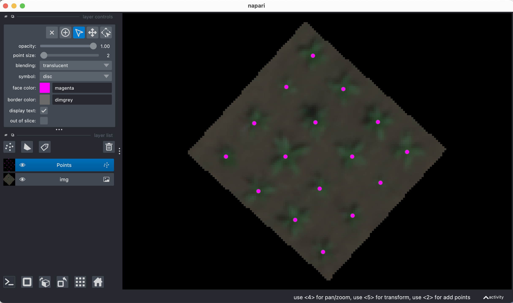

## Convert Points between geojson and lists

Using a Napari or PlantCV-annotate viewer object with clicked points, output a shapefile. Or read in a Point- or MultiPoint-type geojson shapefile and output a list of coordinates in numpy space. 

**plantcv.geospatial.convert.points**(*img, source, dest=None*)

- **Parameters:**
    - img - Spectral image object, likely read in with [`geo.read_geotif`](read_geotif.md). If `source` is the path to a shapefile, the metadata of this image will be used to convert points to numpy coordinates.
    - source - str, Napari.viewer, or plantcv.annotate.classes.Points object. If this is an str then it should be a path to a geojson file to read points from. A Napari.viewer or Points object will be saved to a geojson specified by `dest`.
	- dest - str, Path to save a geojson file if `source` is a Napari.viewer or Points object. This is not required if `source` is a geojson file path.

- **Returns:**
    - coordinates - list of points in numpy coordinates from `source`, and a saved geojson file if `dest` is a viewer or Points object. 


- **Context:**
    - Convert points to/from coordinates and geojson files.
- **Example use:**
    - below to click plant locations


```python
import plantcv.geospatial as gcv
import plantcv.annotate as an

# Read geotif in
img = gcv.read_geotif("../read_geotif/rgb.tif", bands="R,G,B")
viewer = an.napari_open(img=img.pseudo_rgb)
viewer.add_points()

# A napari viewer window will pop up, use the points function to add clicks
```
```python
# In a separate cell, save the output after clicking:
gcv.convert.points(source=viewer, dest="./points_example.geojson", img=img)
```



**Source Code:** [Here](https://github.com/danforthcenter/plantcv-geospatial/blob/main/plantcv/geospatial/convert/points.py)
