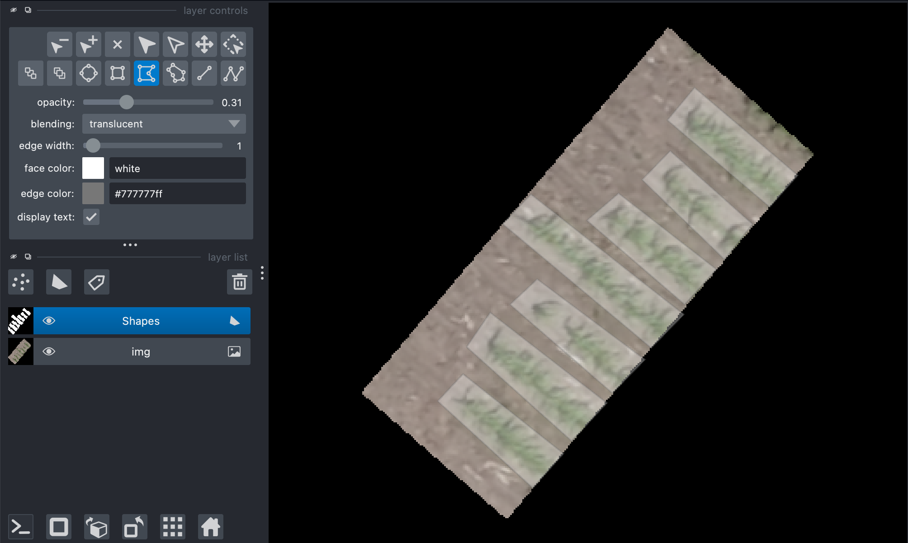

## Convert Shapes between geojson and lists

Using a Napari viewer with drawn polygons, output a shapefile. Or read in a Polygon- or MultiPolygon-type geojson shapefile and output a list of polygon vertex coordinates in numpy space. 

**plantcv.geospatial.convert.shapes**(*img, source, dest=None, shapetype="polygon", layername="Shapes"*)

- **Parameters:**
    - img - GEO image object, likely read in with [`geo.read_geotif`](read_geotif.md). If `source` is the path to a shapefile, the metadata of this image will be used to convert vertex points to numpy coordinates.
    - source - str or Napari.viewer. If this is an str then it should be a path to a geojson file to read shapes from. A Napari viewer should have a polygon like layer that will be saved to a geojson specified by `dest`.
	- dest - str, Path to save a geojson file if `source` is a Napari.viewer. This is not required if `source` is a geojson file path.
    - shapetype - str, Geometry type from Napari viewer shape layer to be written to geojson output. Only used if `source` is a viewer. 
    - layername - str, Name of the shapes layer in the napari viewer. Only used if `source` is a viewer.


- **Context:**
    - Convert shapes to/from coordinates and geojson files.
    - Useful for saving custom plot boundaries to be reused.
- **Example use:**
    - below to outline plot locations


```python
import plantcv.geospatial as gcv
import plantcv.annotate as an

# Read geotif in
img = gcv.read_geotif("../read_geotif/rgb.tif", bands="R,G,B")
viewer = an.napari_open(img=img.thumb)
viewer.add_shapes()

# A napari viewer window will pop up, use the custom polygon function to add shapes
```
```python
# In a separate cell, save the output after clicking:
gcv.convert.shapes(img=img, source=viewer, dest="./shapes_example.geojson")
```



**Source Code:** [Here](https://github.com/danforthcenter/plantcv-geospatial/blob/main/plantcv/geospatial/convert/shapes.py)
