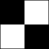

## Getting Started - How to use PlantCV-Geospatial 

PlantCV-Geospatial is designed to facilitate the analysis of geospatial images of plants by making it easy to extract biologically relevant traits. This quick-start guide provides suggestions for starting an analysis in PlantCV-Geospatial, including what you'll need to start and what a resulting dataset should look like. 

You might consider using PlantCV-Geospatial if you have drone or satellite images of fields of plants and are interested in estimating plant traits like color, height, canopy coverage, and vegetative indices. 

If you haven't already, check out our [installation instructions](installation.md) first.

### Table of contents
1. [Obtaining geospatial images for analysis](#geospatial)
    - [Photogrammetry](#photo)
    - [Digital Surface Models](#dsm)
    - [Radiometric calibration](#radio)
    - [Georeferencing](#georef)
2. [Building an analysis workflow](#analysis)
    - [Opening a notebook](#notebook)
    - [Reading in an image](#reading)
    - [Making plot boundaries](#plots)
    - [Extracting traits](#traits)
3. [Saving your data](#save)
4. [Analyzing your data](#analysis)

<br>
**Geospatial images** <a name="geospatial"></a>
Geospatial images can come from a variety of sources like drone flights, publically available datasets of processed field images, or satellites (either publically funded government datasets or commercially available on-demand images).

**Preprocessing**

- **Photogrammetry** - <a name="photo"></a> If you have images from an Uncrewed Aerial System (UAS), like a drone with a camera, those many individual images must be put together to form a picture of your whole field. The process by which this happens is called *photogrammetry* and there are several software programs available for this step. The most commonly used photogrammetry software packages are proprietary and require the purchase of a license. These include Pix4D and MetaShape, though there are many others. OpenDroneMap is a free, open-source option and is more flexible but less user-friendly. Your options might depend on what is available through your institution. 

- **Digital surface models** - <a name="dsm"></a> As part of the process of overlapping individual images to create an orthomosaic, photogrammetry programs can use triangulation to create a 3D point cloud representing the position of pixels. This point cloud is then converted to a model that describes the height of features across space, called a *digital surface model*, or DSM, if it includes things like buildings and plants. PlantCV-Geospatial uses this DSM to calculate plant height (examples below).  

- **Radiometric calibration** - <a name="radio"></a> Because atmospheric conditions can vary between days when collecting images or even during the course of a long UAS flight, it is likely that you will want to calibrate multispectral images prior to analyzing vegetative indices. Some photogrammetry programs can do this calibration using information gathered by sensors on the drone, and sources of satellite data (like NASA) will often distinguish between raw data and processed data that has undergone things like radiometric calibration. If you intend to analyze spectral reflectance, we recommend checking your preprocessing pipeline to ensure calibration is occurring.

- **Georeferencing** - <a name="georef"></a> While many UAS are equipped with a GPS that provides some information about where on Earth each individual image is taken from, this information is often insufficient for guaranteeing that all images in a time series perfectly align. The standard practice is to include Ground Control Points (GCPs) in the field, which are usually black and white checkerboards that are large enough to be clearly visible in the orthomosaic. Since these points do not move during a field season, they provide reference points for aligning images. Georeferencing can be done by either transforming individual orthomosaics using known lat/long coordinates of GCPs, or by choosing a reference image and aligning all other images in the dataset to the coordinates of the reference image's GCPs. Georeferencing can be done using many tools, including the free-to-use QGIS. 

    

<br>
**You have images, now what?** <a name="analysis"></a> <br>
A PlantCV-Geospatial analysis starts with an orthomosaic image, usually saved as a geotif with a `.tif` extension, which is output by whatever photogrammetry software you have used. Now you're ready to build an analysis workflow! 

- **Open a Jupyter notebook** - <a name="notebook"></a> We recommend interacting with PlantCV-Geospatial in a Jupyter notebook. If you have followed the installation instructions and also installed Jupyter, simply run `jupyter lab` from your computer terminal. Alternatively, your favorite interactive environment running python works, too. Your first cell might look something like this:
```python
# PlantCV-Geospatial analysis workflow
# Imports
%matplotlib widget # For plotting
from plantcv import plantcv as pcv # Main PlantCV 
from plantcv import geospatial as gcv

pcv.params.debug = "plot" # For visualization
```

- **Read in your orthomosaic** - <a name="reading"></a> PlantCV-Geospatial reads geotifs and stores the image information as a numpy array and tracks important metadata like coordinate reference system and the transform matrix that converts from image coordinates to latitude/longitude and back. If your image is of a whole field, it might be bigger than the portion you need to analyze and bigger than you want to store in computer memory. You can use the `cropto` option to only read the portion of the image where your field is. This option takes a *geojson* shapefile, which describes the coordinates of a polygon enclosing a region. This type of file can be generated by hand if you know the lat/long coordinates of your field boundaries, or by using a manual program like QGIS. Google Earth can output formats like KML that are easily converted to geojson. See examples for how to read in your image [here](read_geotif.md). 


- **Make plot boundaries** - <a name="plots"></a> Perhaps the most difficult step in a geospatial analysis workflow is determining where in space your individual experimental units are. PlantCV-Geospatial attempts to make this process somewhat flexible with regard to planting strategy and type of plant. Generally, we support various methods for drawing shapes around plants or plots and then saving those shapes to a geojson that will be used by analysis functions. The benefit to this strategy is that if you have many images of the same field over time, as long as they are georeferenced, you can reuse the same plot boundary shapefile for all images, instead of creating new plot boundaries every time. See our [plot boundary guide](plot_boundary_guide.md) for some examples of how to create plot boundaries in PlantCV-Geospatial for various types of plantings. 


- **Extract traits of interest** - <a name="traits"></a> After you have read in your image and drawn boundaries around your plots, you are now ready for the fun part - estimating traits! PlantCV-Geospatial supports several traits, described below:  

    - [**color**](analyze_color.md) - It is likely that you only care about the color of pixels belonging to plants and would like to exclude soil pixels. This means you will first need to make a binary mask, which will represent all pixels belonging to plants as the value '1' and all pixels that do not belong to plants as '0'. Main PlantCV has a great guide for how to do this in a process called *object segmentation*, and has several options in the "Object Segmentation Approaches" [section here](https://docs.plantcv.org/en/stable/analysis_approach/). The function `analyze.color` uses the original image, the binary mask, and the geojson containing plot boundaries to output values for the number of pixels belonging to bins of color values in a chosen color space. 
    
    - [**canopy coverage**](analyze_coverage.md) - Similar to analyzing color, estimating canopy coverage requires a binary mask, because it is calculating the percent of pixels within a plot boundary that are plant vs not-plant. After following the same steps as above, `analyze.coverage` will use your image, the binary plant mask, and the plot boundary shapefile to output percent coverage values for every plot.
    
    - [**vegetative indices**](analyze_spectral_index.md) - Plant health and performance is sometimes estimated using reflectance indices calculated by using different bands in an image in various mathematical formulas. One commonly used index is the Normalized Difference Vegetative Index, or NDVI, which is generally thought of as the "greenness" of plants in an image. Main PlantCV has a [suite of functions](https://docs.plantcv.org/en/stable/spectral_index/) designed to calculate many indices from an input image, provided it has the necessary bands. Those functions create a new image object, which PlantCV-Geospatial's `analyze.spectral_index` function takes as input, along with the plot boundary geojson, to ouput counts of pixels in bins for the index value. 
    
    - Height - PlantCV-Geospatial can calculate average height of plants in a plot in two ways, depending on what data you have. If you have an image of the field before plants have started growing, sometimes called a "bare ground flight," `analyze.height_subtraction` creates a Canopy Height Model (CHM) representing the height of every pixel from a timepoint with plants minus the bare ground (see [docs here](analyze_height_subtraction.md)). The CHM is then used to calculate distributions and summary statistics of height for every plot. If you do not have a bare ground flight, PlantCV-Geospatial can calculate height by assuming that, within a plot, the tallest pixels belong to the top of the plant canopy and the shortest pixels represent the soil between plants. Then, by setting a percentile cutoff for the top and bottom, and subtracting the two, `analyze.height_percentile` outputs an average value for height per plot (see [docs here](analyze_height_percentile.md)). 


**Saving your data** <a name="save"></a>

PlantCV-Geospatial uses main PlantCV's [`Outputs` class](https://docs.plantcv.org/en/stable/outputs/#class-outputs) to store the results from any of the analysis functions described above. An object containing all of your results is created automatically when you run any analysis function, along with important metadata like the date the workflow was run and the version of PlantCV you have installed. Individual plots are ID'd using the geojson plot boundary file, so the same plot will have the same label across time points. To combine data from multiple timepoints during a field season, we recommend adding a metadata term to the outputs, like in the example below:

```python
# Add color measurements to outputs object
date = "06182026"
vis = gcv.analyze.color(img, bin_mask, geojson)
# Add date metadata
pcv.outputs.add_metadata(term="date", datatype="str", value=date)
# Save results in a json file
pcv.outputs.save_results(filename="./Color_outputs/"+date+".txt")
```

Then, once you have run your analysis workflow on all timepoints, you can combine the files in the folder `"./Color_outputs/"` like so:

```python
from plantcv import parallel
parallel.process_results(job_dir="./Color_outputs/", 
                         json_file="./color_timepoints_combined.txt")
```

And finally, you can convert the combined data to a more readable csv file including your date metadata column and measurements for every plot at every timepoint using the main PlantCV [json2csv utility](https://docs.plantcv.org/en/stable/tools/#plantcv-utilities) in the command line:

```bash
plantcv-utils json2csv -j "./color_timepoints_combined.txt" -c "./color_timepoints_combined"
```

**Analyzing your data** <a name="analysis"></a>

The `.csv` file resulting from saving and combining datasets from individual timepoints is formatted such that common statistical analyses can be performed using whatever method you are already comfortable with. However, we also recommend trying [pcvr](https://danforthcenter.github.io/pcvr/), an R package designed to analyze PlantCV outputs. 