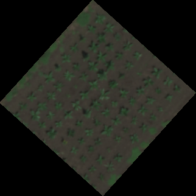
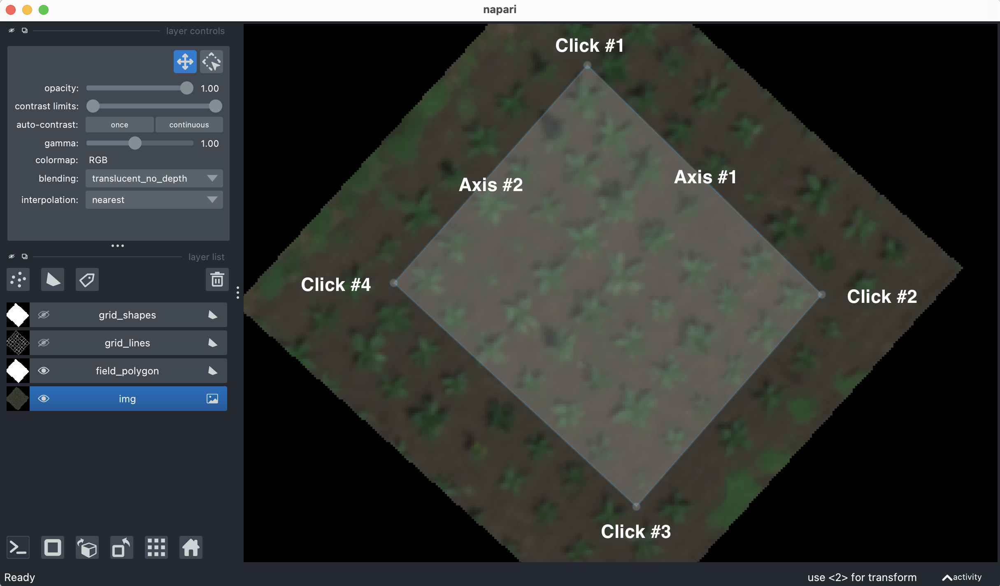
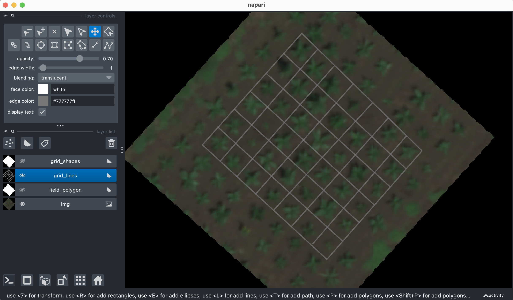
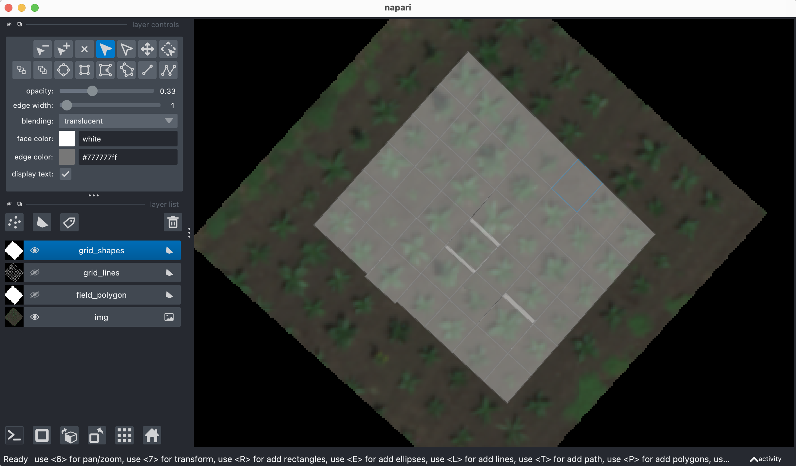

## Napari field grid

Using a Napari viewer with a shapes layer polygon outlining the whole field, functions `napari_grid` and `napari_polygon_grid` create grid cells around individual units for measurement. Can be followed by either saving out the grid cells in a shapefile (coming soon!) or using the center points to make ROIs using `center_grid_rois`. 

**plantcv.geospatial.napari_grid**(*viewer, numdivs, layername="Shapes"*)
**plantcv.geospatial.napari_polygon_grid**(*viewer*)

Does not return anything, but adds shapes layers to the Napari viewer object that contain first the grid lines and then the polygons created by the line intersections.

- **Parameters:**
    - veiwer - Napari viewer object. The input viewer to `napari_grid` must have a shapes layer wher the user has added a  polygon that outlines the field on which to draw the grid.
    - numdivs - A list of length two in the form [number of divisions across axis 1, number of divisions across axis 2]. The order of the axes is dependent on the order in which the corners are clicked during generation of the whole-field polygon. See example below for more information.
    - layername - String. Name given to the shapes layer of the Napari viewer in which the whole-field polygon is defined. 

- **Context:**
    - These two functions are designed to be used to define boundaries for single plants or single plots in a field that is planted in a grid, but maybe not precision planted. 
    - The use of a Napari viewer means the user can adjust both the lines and the polygons after they are created in case the spacing is not perfect, or that is inconsistent across the field.

- **Example use:**
    - below

```python
import plantcv.plantcv as pcv
import plantcv.annotate as an
import plantcv.geospatial as geo

pcv.params.debug = "plot"

# Read geotif in
img = geo.read_geotif("./grid_field.tif", bands="B,G,R,RE,N")
# Open a napari viewer and add a shapes layer called "field_polygon"
viewer = an.napari_open(img=img.pseudo_rgb)
viewer.add_shapes(name="field_polygon")

# Now, when the Napari viewer opens, the user should add a polygon to the shapes layer around the field.
# In the example image below, the corners are labeled in the order they were clicked.
# The axes are also numbered for informing the numdivs parameter in the next step.
# Clicking the field corners in a different order will change the axis direction.

# Make grid lines
geo.napari_grid(viewer, numdivs=[7,6], layername="field_polygon")

# User can at this point adjust the position of the lines to better match any planting irregularities.
# Make grid polygons
geo.napari_polygon_grid(viewer)

# At this point, polygons can be adjusted individually for even finer adjustment


```

**Read in geotif:**



**Adding field polygon to shapes layer:**



**After adjusting position of grid lines:**



**After adjusting vertices of grid polygons:**



**Source Code:** [Here](https://github.com/danforthcenter/plantcv-geospatial/blob/main/plantcv/geospatial/napari_grid.py)
**Source Code:** [Here](https://github.com/danforthcenter/plantcv-geospatial/blob/main/plantcv/geospatial/napari_polygon_grid.py)
