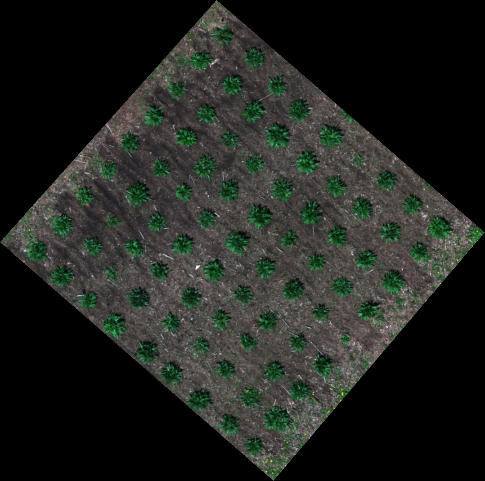
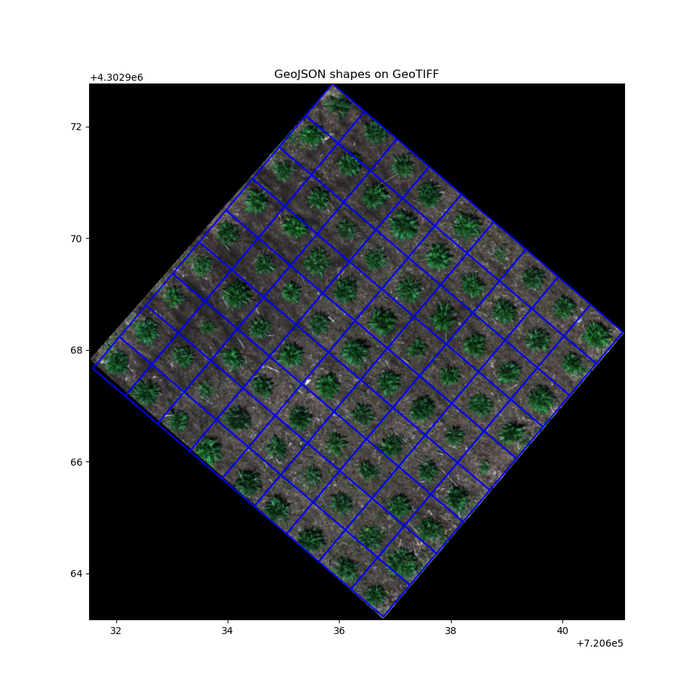

# Guide for creating plot boundaries in PlantCV-Geospatial

Here we provide some suggestions on how to outline your individual plants or plots depending on your planting strategy.
If this is your first time using PlantCV-Geospatial, we recommend checking out our [Getting Started guide](getting_started.md) first!

### Table of contents
1. [Field layout vocabulary](#vocab) 
2. [Individual plants](#individual)
    - [In a grid](#grid)
    - [Irregular spacing](#irregular)
3. [Row crops](#rows)
    - [Precision planted](#precision)
    - [Irregular spacing](#row_irregular)


**Field layout vocabulary** <a name="vocab"></a> <br>
Several plot boundary creation tools in PlantCV-Geospatial rely on named parameters that follow a consistent way of describing how you might layout a field experiment. Refer to the diagram below for the common terms. Because of the transformation from latitude and longitude, your field might be tilted, so the designation of range vs column is relative to the top left corner of the field. PlantCV-Geospatial has a [`Field_layout` class](Field_layout.md) designed to keep track of these parameters. We recommend filling this out at the beginning of your notebook.


```python
# A notebook for field analysis

# Imports
%matplotlib widget
import plantcv.plantcv as pcv
import plantcv.geospatial as gcv

pcv.params.debug = "plot"

# Fill out experimental details - in meters
gcv.field_layout.num_ranges=9
gcv.field_layout.num_columns=9
gcv.field_layout.range_length=0.74
gcv.field_layout.row_length=0.76
gcv.field_layout.num_rows=1
gcv.field_layout.range_spacing=0
gcv.field_layout.column_spacing=0
```

**Individual plants** <a name="individual"></a> 
Your experimental units might be individual plants, like this:



- **In a grid** <a name="grid"></a> - If your individual plants are in a relatively uniform grid, like the example above, you should first try the most automated of PlantCV-Geospatial's plot boundary creation methods, [`create_shapes.auto_grid`](shapes_grid.md), which accounts for the attributes of `field_layout` to create and save a grid of plot boundaries. 

```python
# Other parameters are taken automatically from field_layout if you have filled it in
gcv.create_shapes.auto_grid(img, cropto="./field_corners.geojson", outpath="./plots.geojson")
```



- **Irregularly spaced** <a name="irregular"></a> - If your individual plants are planted less uniformly, [Write about interactive shapes]