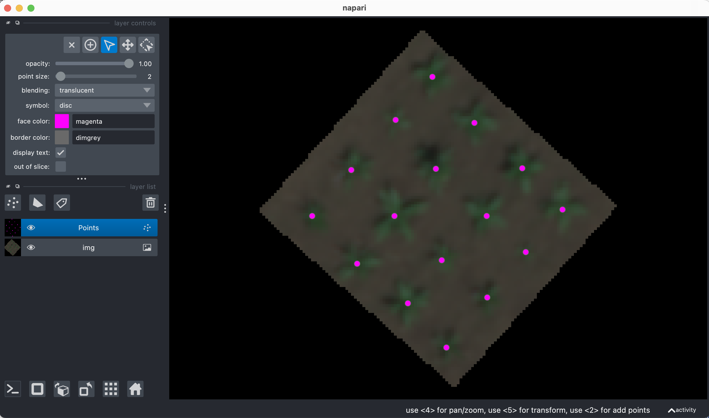

## Output clicked points as a geojson shapefile

Using a Napari or PlantCV-annotate viewer object with clicked points, output a shapefile.  

**plantcv.geospatial.points_to_geojson**(*img, viewer, out_path*)

- **Parameters:**
    - img - Spectral image object, likely read in with [`geo.read_geotif`](read_geotif.md)
    - viewer - Napari viewer class object, possible created with PlantCV-Annotate.
    - out_path - Path to save the geojson shapefile. Must be ".geojson" file type. 

- **Context:**
    - Saved points can be used downstream for generating circular ROIs or circles for use with rasterstats. 
- **Example use:**
    - below to click plant locations


```python
import plantcv.geospatial as gcv
import plantcv.annotate as an

# Read geotif in
img = gcv.read_geotif("../read_geotif/rgb.tif", bands="R,G,B")
viewer = an.napari_open(img=img.pseudo_rgb)
viewer.add_points()

# A napari viewer window will pop up, use the points function to add clicks
```
```python
# In a separate cell, save the output after clicking:
gcv.points_to_geojson(img, viewer, out_path="./points_example.geojson")
```



**Source Code:** [Here](https://github.com/danforthcenter/plantcv-geospatial/blob/main/plantcv/geospatial/points_to_geojson.py)