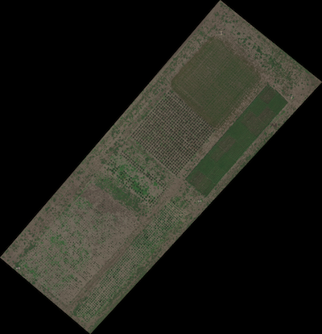
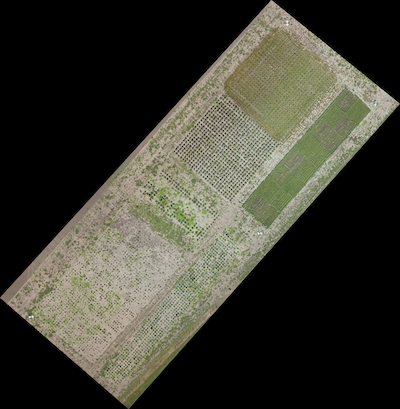

## Read Geo-tif Data

Read in data (from tif format, most likely georeferenced image data). 

**plantcv.geospatial.read_geotif**(*filename, bands="B,G,R", cropto=None*)

**returns** [PlantCV Spectral_data](https://plantcv.readthedocs.io/en/latest/Spectral_data/) object instance.

- **Parameters:**
    - filename - Path of the TIF image file.
    - bands - Comma separated string representing the order of image bands (e.g., `bands="B,G,R"`), or a list of wavelengths (e.g., `bands=[650, 560, 480]`)
        - Supported symbols and their default wavelengths: 
            - R (red) = 650nm
            - G (green) = 560nm
            - B (blue) = 480nm
            - RE (rededge) = 717nm
            - N or NIR (near infrared) = 842nm
    - cropto - A geoJSON-type shapefile to crop the input image as it is read in. Default is None. 

- **Example use:**
    - below


```python
import plantcv.geospatial as geo

# Read geotif in
ortho1 = geo.read_geotif(filename="./data/example_img.tif", bands="b,g,r,RE,NIR")
ortho2 = geo.read_geotif(filename="./data/example_rgb_img.tif", bands="B,G,R")

```





**Source Code:** [Here](https://github.com/danforthcenter/plantcv-geospatial/blob/main/plantcv/geospatial/read_geotif.py)
