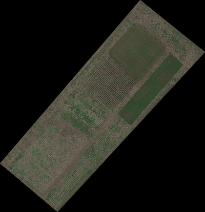
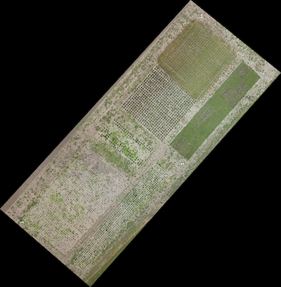
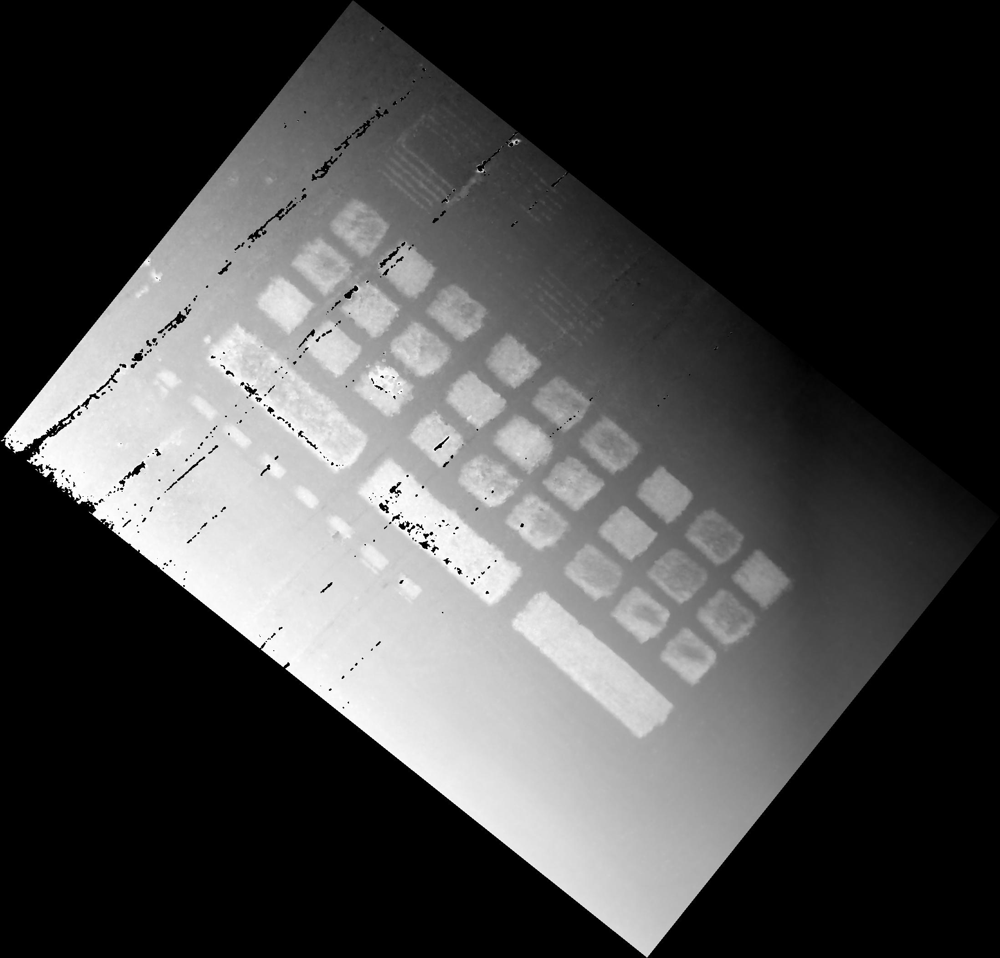

## Read Geo-tif Data

Read in data from a GeoTIFF file (e.g., georeferenced aerial or multispectral imagery).

**plantcv.geospatial.read.geotif**(*filename, bands="R,G,B", cropto=None, cutoff=None*)

**returns** [GEO or DSM](image_classes.md) object instance, single channel geotifs will be read into DSMs, multiple wavelength geotifs will be read to GEO objects.

- **Parameters:**
    - filename - Path of the TIF image file.
    - bands - A comma-separated string of band labels (e.g., "R,G,B") or a list of wavelengths in nm (e.g., [650, 560, 480]). Default is "R,G,B".
        - Supported symbols (case insensitive) and their default wavelengths: 
            - "R" (red) = 650nm
            - "G" (green) = 560nm
            - "B" (blue) = 480nm
            - "RE" (rededge) = 717nm
            - "N" or "NIR" (near infrared) = 842nm
            - "mask" (a binary mask to represent regions of no data in the image) = 0nm
            - "gray" (a grayscale image, usually a digital surface or elevation model) = 0nm
    - cropto - A path to a GeoJSON file used to crop the input image upon reading. Default is None.
    - cutoff - An optional percentile threshold (0–1) for clipping high values in grayscale bands (e.g., to remove noise from power lines or bright artifacts). Values above this percentile are set to 0. Default is None.

- **Context:**
    - This function aims to handle variability in data type, depth, and common "No-Data" values of Geo-tifs. There is some flexibility in formats supported but we encourage people to reach out on [GitHub](https://github.com/danforthcenter/plantcv-geospatial/issues) and collaborate with the PlantCV community to expand our support.
    - Negative values are masked to a value of 0 to account for common no data values, and for errant negative values that can result from calibration since reflectance is bounded 0-1.
    - Utilizing `cropto` can significantly reduce the memory needed to run a geospatial workflow. 
    - Setting cutoff is useful if you have things like power lines in your image. The debug image will be scaled to min and max value after filtering, so it is useful for choosing an appropriate threshold. 

- **Example use:**
    - Read in geospatial data

```python
import plantcv.geospatial as gcv

# Read geotif in
geo1 = gcv.read.geotif(filename="./data/example_img.tif", bands="B,G,R,RE,NIR")
geo2 = gcv.read.geotif(filename="./data/example_rgb_img.tif", bands="R,G,B,mask",
                         cropto="./shapefiles/experimental_bounds.geojson")
dsm3 = gcv.read.geotif(filename="./data/example_gray_img.tif", bands="gray", cutoff=0.99)

```







**Source Code:** [Here](https://github.com/danforthcenter/plantcv-geospatial/blob/main/plantcv/geospatial/read/geotif.py)
