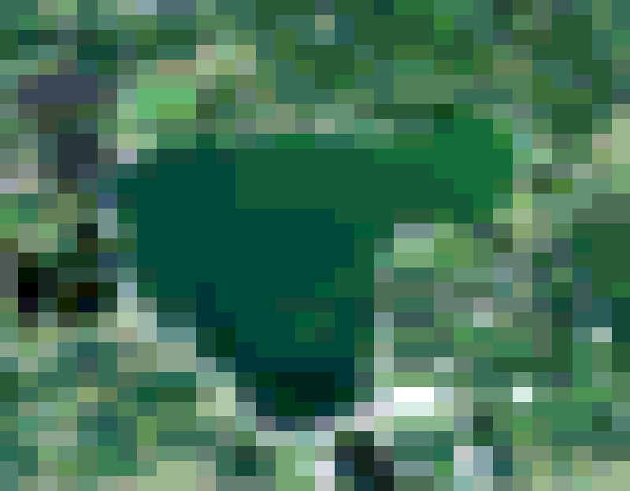

## Read NASA-formatted NetCDF Data

Read in data from a NetCDF file, formatted as NASA data downloads with all bands contained in the geophysical data group variables. 

**plantcv.geospatial.read_netcdf**(*filename, cropto, output=False*)

**returns** [PlantCV Spectral_data](https://plantcv.readthedocs.io/en/latest/Spectral_data/) object instance.

- **Parameters:**
    - filename - Path of the NetCDF file.
    - cropto - A geoJSON-type shapefile to crop the input image as it is read in, or a list of the min/max values for latitude and longitude. Format expected is [min longitude, min latitude, max longitude, max latitude]. 

- **Context:**
    - It is common for satellite data downloaded from NASA or Copernicus to be in the NetCDF file format. However, this format can be quite variable. Currently, this function is written for the multi-band NASA style of NetCDF output. If additional flexibility is desirable, we encourage people to reach out on [GitHub](https://github.com/danforthcenter/plantcv-geospatial/issues) and collaborate with the PlantCV community to expand our support.
    - Currently we require the use of `cropto`, a shapefile or list of bounding coordinates. This is primarily because the method for calculating the affine transform matrix between array coordinates and geospatial coordinates is impacted by the shape of the Earth if the coverage is too large, as is typical of satellite images. Cropping to a smaller region decreases that effect.  

- **Example use:**
    - below

```python
import plantcv.geospatial as geo

# Read in NetCDF file
nasafile = "./sentinel-3_example.nc"
spectral_data = read_netcdf(nasafile, "./bigspiritlake.geojson") 

```




**Source Code:** [Here](https://github.com/danforthcenter/plantcv-geospatial/blob/main/plantcv/geospatial/read_netcdf.py)
