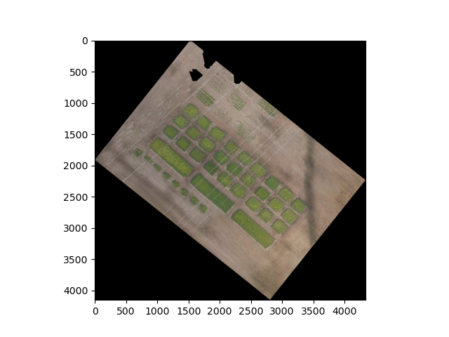
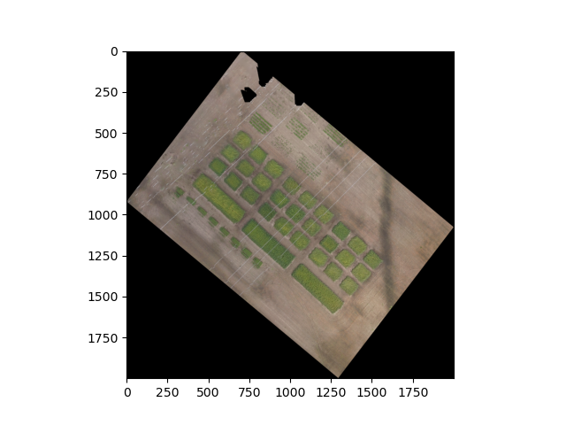

## Resize a geospatial image

Resize a `GEO`, or `DSM` object to a desired pixel size. Wraps `plantcv.plantcv.transform.resize` and updates the affine transform on `GEO` and `DSM` objects to preserve geospatial coordinates after resizing.

**plantcv.geospatial.resize**(*img, size, interpolation="auto"*)

**returns** Resized image of the same class as the input

- **Parameters:**
    - img - `Image`, `GEO`, or `DSM` object, typically read in with [`gcv.read_geotif`](read_geotif.md)
    - size - Output image size in pixels as a tuple `(width, height)`
    - interpolation - Interpolation method (default: `"auto"`):
        - `"auto"` = automatically select `"bicubic"` when enlarging, `"area"` when reducing
        - `"area"` = resampling using pixel area relation (recommended for shrinking)
        - `"bicubic"` = bicubic interpolation over a 4×4 pixel neighborhood
        - `"bilinear"` = bilinear interpolation
        - `"lanczos"` = Lanczos interpolation over an 8×8 pixel neighborhood
        - `"nearest"` = nearest-neighbor interpolation (recommended for masks)
        - `None` = no interpolation; crop or zero-pad to reach the target size

- **Context:**
    - When resizing a `GEO` or `DSM` object, the affine transform is scaled so that geospatial coordinates remain valid at the new resolution. The top-left corner of the image is preserved; only the pixel size components of the transform are updated.

```python
import plantcv.geospatial as gcv

# Read a multispectral geotif
ortho = gcv.read_geotif(filename="./data/example_img.tif", bands="b,g,r,RE,NIR")

# Resize to 500 x 500 pixels using the default auto interpolation
resized = gcv.resize(img=ortho, size=(2000, 2000))

```
**Before**


**After**



**Source Code:** [Here](https://github.com/danforthcenter/plantcv-geospatial/blob/main/plantcv/geospatial/resize.py)
