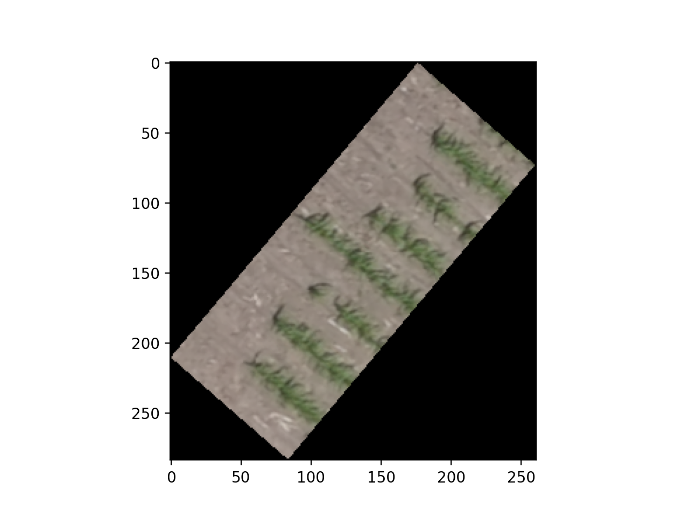
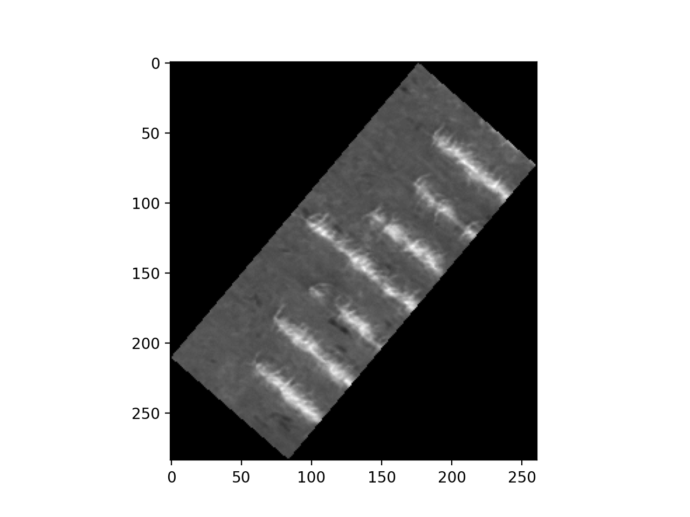

## Save Geo-tif Data

Save data from segmentation or modification of a geotif. The resulting geotif file will have the same georeferenced coordinates as the original image. 

**plantcv.geospatial.save_geotif**(*out_img, in_img, out_path, nodata=None*)

- **Parameters:**
    - out_img - Image to be saved, could be a segmented mask generated by PlantCV.
    - in_img - Spectral_data object created by read_geotif. Used to access metadata.
    - out_path - Path to save the output geotif.
    - nodata - Value to assign as "no data" during saving out. Default is "None". 

- **Example use:**
    - below


```python
import plantcv.geospatial as geo
import plantcv.plantcv as pcv

# Read geotif in
img = geo.read_geotif(filename="./rgb.tif", bands="R,G,B")
# Threshold using PlantCV
gray_rgb = pcv.rgb2gray_hsv(rgb_img=img.pseudo_rgb, channel="s")
thresh_rgb = pcv.threshold.binary(gray_img=gray_rgb, threshold=60, object_type="light")
# Save mask as a geotif
geo.save_geotif(thresh_rgb, img, "./masked_rgb.tif")

```





**Source Code:** [Here](https://github.com/danforthcenter/plantcv-geospatial/blob/main/plantcv/geospatial/save_geotif.py)
