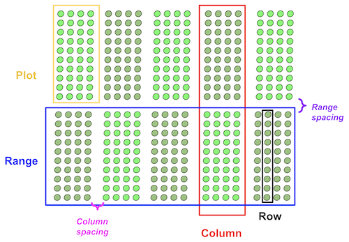
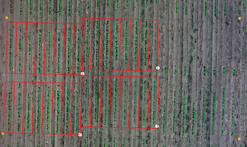
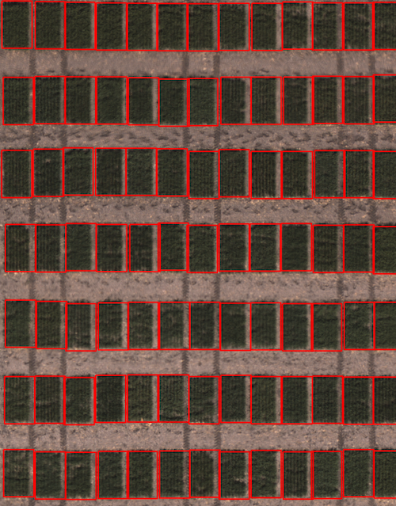

## Create cells from input points GeoJSON and save them to a new GeoJSON

**geospatial.shapes.flexible**(*img, field_corners_path, plot_geojson_path, out_path, range_length, column_length, num_rows=1*)

**returns** figure

- **Parameters:**
    - img - Spectral_Data object of geotif data, used for plotting a debug image, likely read in with [`geo.read_geotif`](read_geotif.md)
    - field_corners_path - Path to GeoJSON/shapefile containing four corner points (used to determine polygon directions, and the output CRS)
    - plot_geojson_path - Path to geojson containing plot corner points
    - out_path - Path to save the geojson shapefile. Should be ".geojson" file type. 
    - range_length - Vertical dimension of each plot, in units matching the coordinate system of the `field_corners_path`
    - column_length - Horizontal dimension of each plot, in units matching the coordinate system of the `field_corners_path`
    - num_rows - Number of rows per plot, default: 1

- **Context:**
    - Helpful for precision planters without GPS
    



- **Example use:**
    - Example image from the [Bison-Fly: UAV pipeline at NDSU Spring Wheat Breeding Program](https://github.com/filipematias23/Bison-Fly) below. 


```python
import plantcv.geospatial as geo

# Read geotif in
ortho1 = geo.read_geotif(filename="./data/example_maize_img.tif", bands="b,g,r,RE,NIR")
# Create and visualize GeoJSON of plots
figure = geo.shapes.flexible(img=ortho1, field_corners_path="bounds.geojson",
            plot_geojson_path="plot_points.geojson",
            out_path="gridcells.geojson", 
            range_length=3.6576, row_length=0.9144,
            num_rows=8)

```
**Example GeoJSON inputs & outputs explained**

`field_corners_path` here is represented with yellow points, `plot_geojson_path` with white points, and the resulting `out_path="gridcells.geojson"` is shown in red. Note that the `plot_geojson_path` points are in the bottom right corner of each grid cell, so the `field_corners_path` points are collected starting in the bottom right corner and moving clockwise. 



```python
import plantcv.geospatial as geo

# Read geotif in
ortho2 = geo.read_geotif(filename="./data/example_wheat_img.tif", bands="R,G,B")
# Create and visualize GeoJSON of plots
figure2 = geo.shapes.flexible(img=ortho2, field_corners_path="wheat_bounds.geojson",
            plot_geojson_path="wheat_plots.geojson",
            out_path="wheat_cells.geojson", 
            range_length=2.5, row_length=1.6,
            num_rows=1)

```
**Example GeoJSON debug image**



**Source Code:** [Here](https://github.com/danforthcenter/plantcv-geospatial/blob/main/plantcv/geospatial/shapes/flexible.py)
