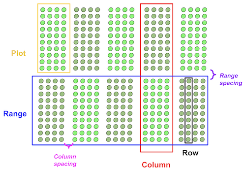

## Create a grid of cells and save them to a new GeoJSON/Shapefile

**plantcv.geospatial.shapes.grid**(*img, field_corners_path, out_path, num_ranges, num_columns,
         range_length, row_length, num_rows=1, range_spacing=0, column_spacing=0)

**returns** figure

- **Parameters:**
    - img - Spectral_Data object of geotif data, used for plotting a debug image, likely read in with [`read_geotif`](read_geotif.md)
    - field_corners_path - Path to GeoJSON/shapefile containing four corner points (used to determine polygon directions, and the output CRS)
    - out_path - Path to save the geojson shapefile. Should be ".geojson" file type. 
    - num_ranges - Number of ranges to get created
    - num_columns - Number of columns to get created
    - range_length - Length of each grid cell in the horizontal direction, in units matching the coordinate system of the `field_corners_path`
    - row_length - Length of each grid cell in the vertical direction, in units matching the coordinate system of the `field_corners_path`
    - num_rows - Number of rows within a single plot, default: 1
    - range_spacing - Length of "alley" spaces between ranges, default: 0
    - column_spacing - Length of "alley" spaces between columns, default: 0

- **Context:**
    - Helpful for precision planted experiments




- **Example use:**
    - Example image from the [Bison-Fly: UAV pipeline at NDSU Spring Wheat Breeding Program](https://github.com/filipematias23/Bison-Fly) below. 


```python
import plantcv.geospatial as gcv

# Read geotif in
ortho1 = gcv.read_geotif(filename="./data/example_img.tif", bands="b,g,r,RE,NIR")
# Create and visualize GeoJSON of plots
figure = gcv.shapes.grid(img=img, field_corners_path="bounds.geojson", 
            out_path="gridcells.geojson", num_ranges=22, num_columns=13,
            num_rows=1, range_spacing=1.5,  range_length=2.5, row_length=1.6)

```
**Example GeoJSON output figure**


**Source Code:** [Here](https://github.com/danforthcenter/plantcv-geospatial/blob/main/plantcv/geospatial/shapes/grid.py)
