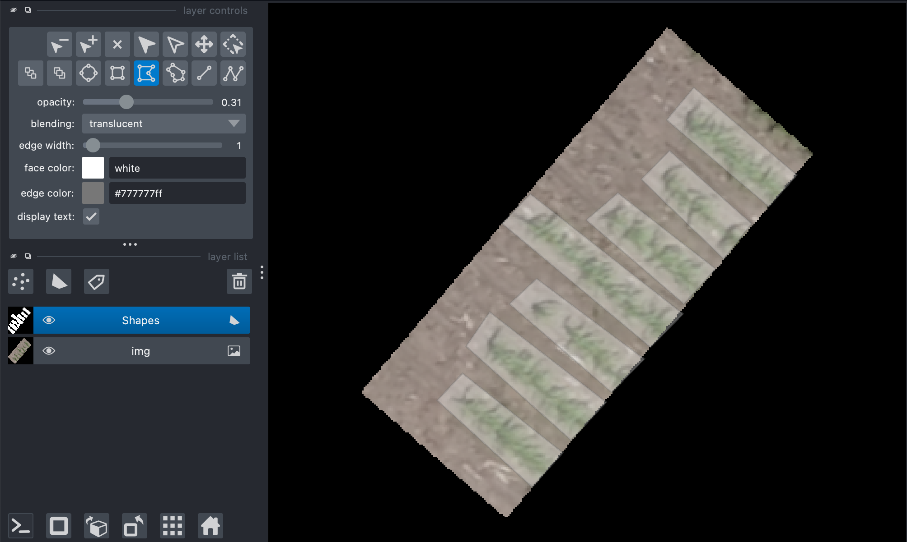

## Output drawn shapes as a geojson shapefile

Using a Napari viewer object with a shapes layer, output a shapefile.  

**plantcv.geospatial.shapes_to_geojson**(*img, viewer, out_path, shapetype="polygon", layername="Shapes"*)

- **Parameters:**
    - img - Spectral image object, likely read in with [`read_geotif`](read_geotif.md)
    - viewer - Napari viewer class object, possible created with PlantCV-Annotate.
    - out_path - Path to save the geojson shapefile. Must be ".geojson" file type. 
    - shapetype - The type of geometry contained in the shapes layer.
	- layername - The name of the shape layer to use, defaults to "Shapes".

- **Context:**
    - Saved shapefiles can be used downstream for use with rasterstats or in parallel workflows. 
- **Example use:**
    - below to save out plot boundaries


```python
import plantcv.geospatial as gcv
import napari

# Read geotif in
img = gcv.read_geotif("./rgb.tif", bands="R,G,B")

viewer = napari.Viewer()
viewer.add_image(img.pseudo_rgb)
viewer.add_shapes()


# A napari viewer window will pop up, use the various available geometries to add shapes
```
```python
# In a separate cell, save the output after drawing shapes:
gcv.shapes_to_geojson(img, viewer, out_path="./plot_boundaries.geojson", shapetype="polygon")
```



**Source Code:** [Here](https://github.com/danforthcenter/plantcv-geospatial/blob/main/plantcv/geospatial/shapes_to_geojson.py)
