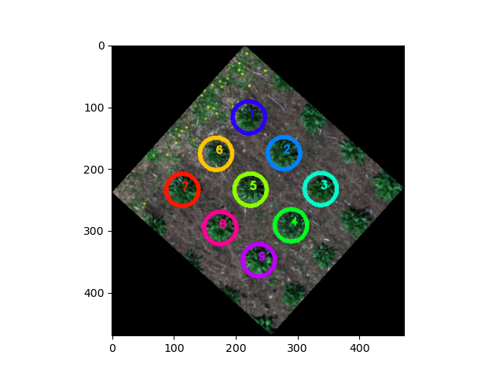
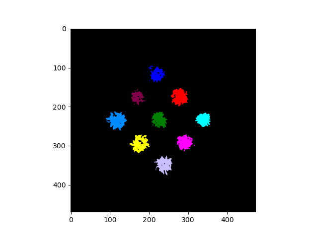

## Create ROIs from points or polygon shapefiles

Transform features from shapefile/GeoJSON to Regions of Interest (ROIs). If shapefile contains points, this function saves a shapefile/GeoJSON of the created circular ROIs wiht `_circles` suffix.

**plantcv.geospatial.convert.to_roi**(*img, geojson, radius=None*)

**returns** list of ROIs (`plantcv.Objects` instance)

- **Parameters:**
    - img -  GEO image object, likely read in with [`geo.read_geotif`](read_geotif.md).
    - geojson - Path to the shapefile/GeoJSON containing the points or polygons.
    - radius - Optional radius of circular ROIs to get created,
                in units matching the coordinate system of the image.
				If this is provided then the geojson is assumed to contain points.

- **Context:**
    - Directly create ROIs with a consistent georeferenced radius and write geojson of ROIs.
- **Example use:**
    - below


```python
import plantcv.geospatial as gcv
import plantcv.plantcv as pcv

# Read geotif in
img = gcv.read_geotif(filename="./data/example_img.tif", bands="b,g,r,RE,NIR")

# Make ROIs from a points-type shapefile
rois = gcv.convert.points_to_roi_circle(img, geojson="./points_example.geojson", 
                                        radius=1)

# "./points_example_circles.geojson" file can be used for gcv.analyze functions
res = gcv.analyze.height_percentile(img, geojson="./points_example_circles.geojson")

# ROIs can be used in main PlantCV 
# Segment plants to get a binary mask
labeled_mask, num_plants = pcv.create_labels(mask=binary_mask, 
                                             rois=rois, roi_type="partial")
```





**Source Code:** [Here](https://github.com/danforthcenter/plantcv-geospatial/blob/main/plantcv/geospatial/convert/points_to_roi.py)
