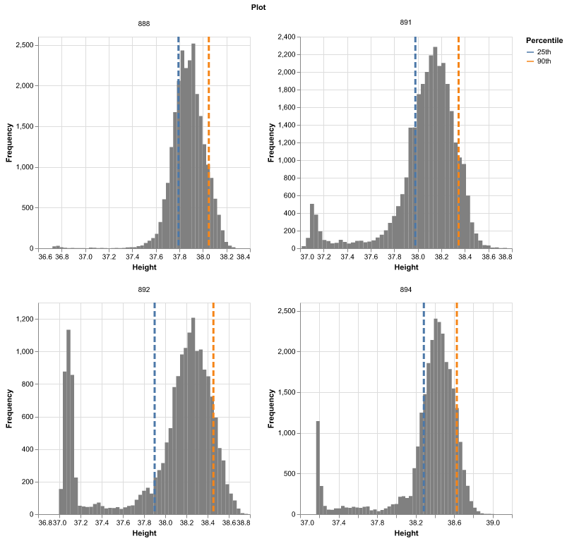

## Visualize height distributions 

Plots histograms of height values for a random subset of plots in a shapefile, to help choose suitable percentile cutoff values for [`analyze.height_percentile`](analyze_height_percentile.md). Each subplot shows the requested `lower`/`upper` percentiles as vertical reference lines so it's easy to see where they fall relative to the distribution (e.g. a soil elevation peak vs. a canopy elevation peak).

**plantcv.geospatial.visualize.height_distribution**(*img, geojson, n=9, bins=50, lower=25, upper=90, seed=None, label=None*)

**returns** Altair facet chart with a grid of histograms, one per sampled plot.

- **Parameters:**
    - img - DSM image object, read in with [`read_geotif`](read_geotif.md)
    - geojson - Path to the shapefile/GeoJSON containing the plot boundaries to sample from. Can be Polygon or MultiPolygon geometry.
    - n - Number of plots to randomly graph, default `n=9`. If the geojson contains fewer regions than `n`, all regions are used.
    - bins - Number of histogram bins, default `bins=50`
    - lower - Lower percentile cutoff to mark on each histogram, default `lower=25`
    - upper - Upper percentile cutoff to mark on each histogram, default `upper=90`
    - seed - Random seed, for reproducible plot sampling, default `seed=None`
    - label - Optional label used in the debug output filename (default = `pcv.params.sample_label`)

- **Context:**
    - This function does not save data to `Outputs`; it is a data exploration tool for choosing `lower`/`upper` values ahead of running [`analyze.height_percentile`](analyze_height_percentile.md).

- **Example use:**

```python
import plantcv.geospatial as gcv
import plantcv.plantcv as pcv

# Read in dsm as geotif
dsm = gcv.read.geotif(filename="./data/example_dsm.tif", bands=[0])

# Preview the height distribution of 4 random plots to help choose percentile cutoffs
chart = gcv.visualize.height_distribution(img=dsm,
                                          geojson="./shapefiles/experimental_plots.geojson",
                                          n=4, lower=25, upper=90, seed=123)
```


**Source Code:** [Here](https://github.com/danforthcenter/plantcv-geospatial/blob/main/plantcv/geospatial/visualize/height.py)
